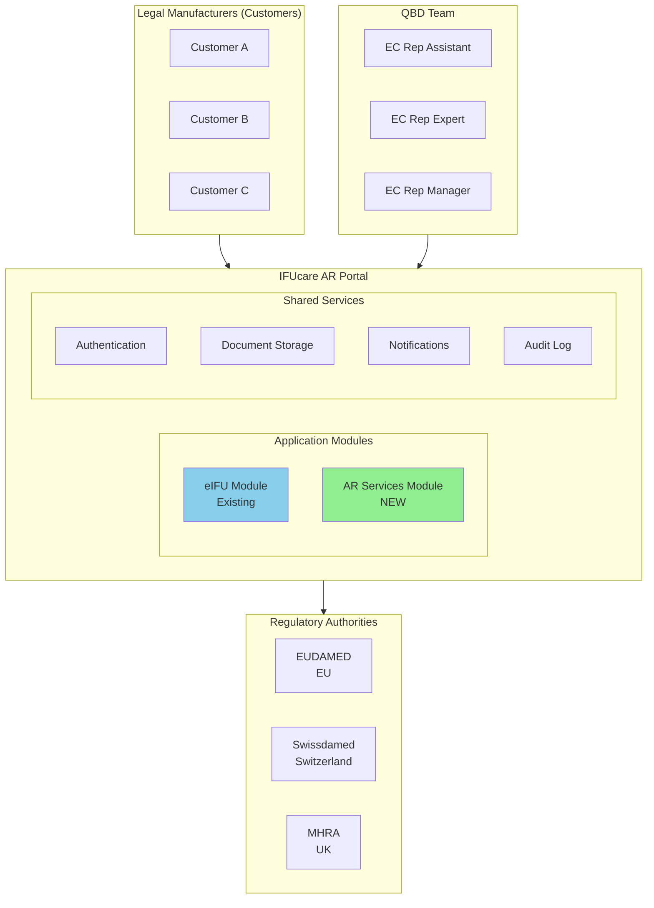
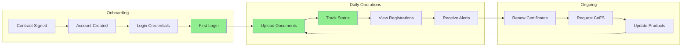
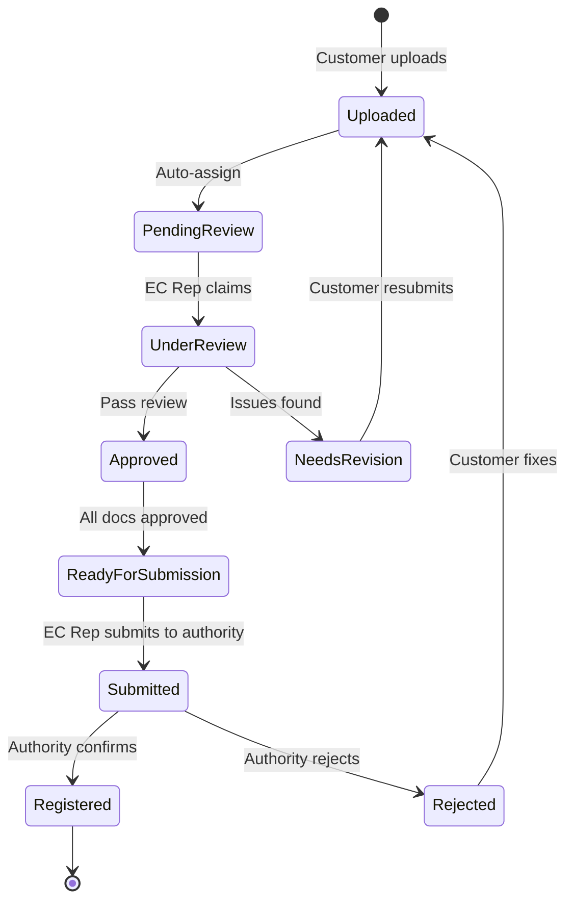
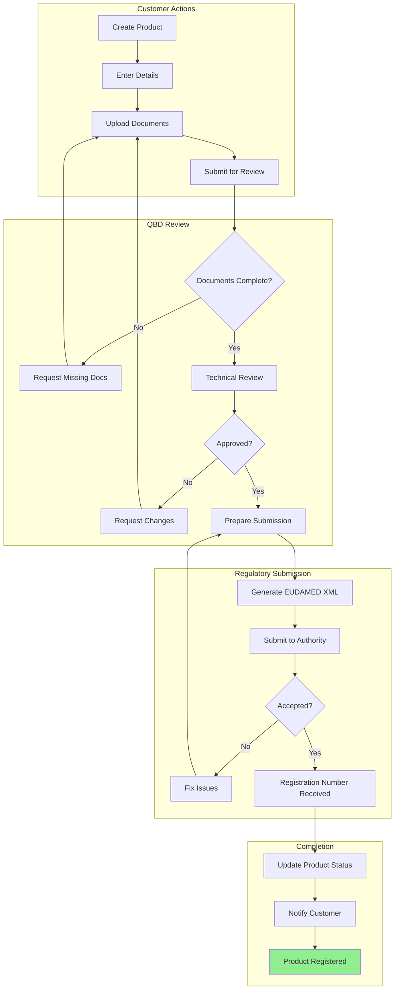
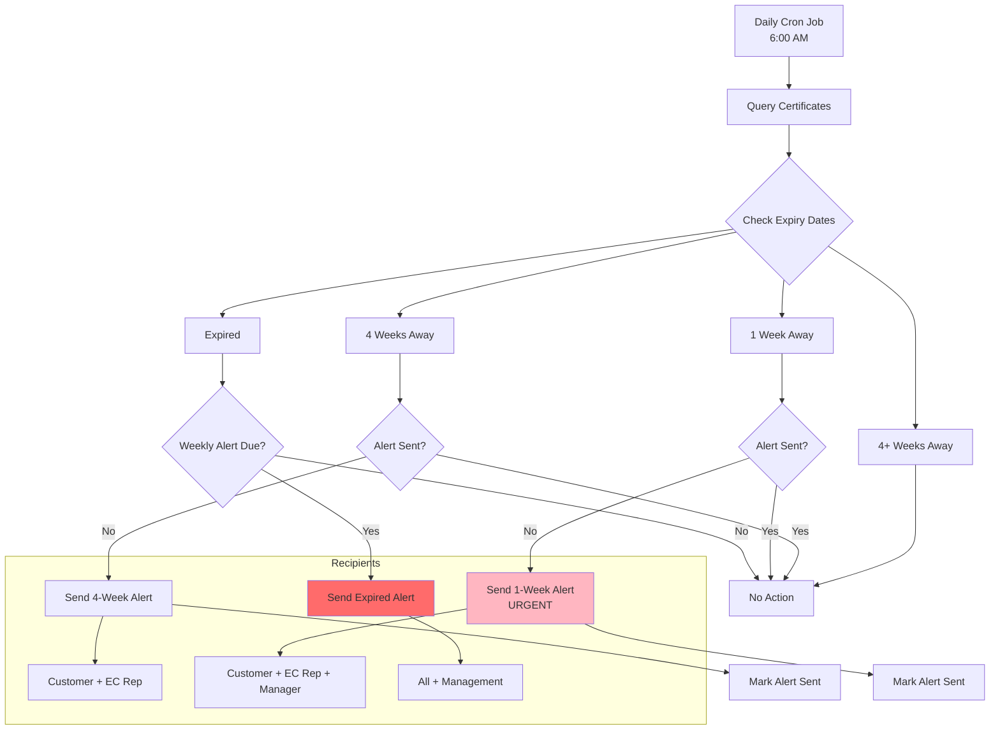
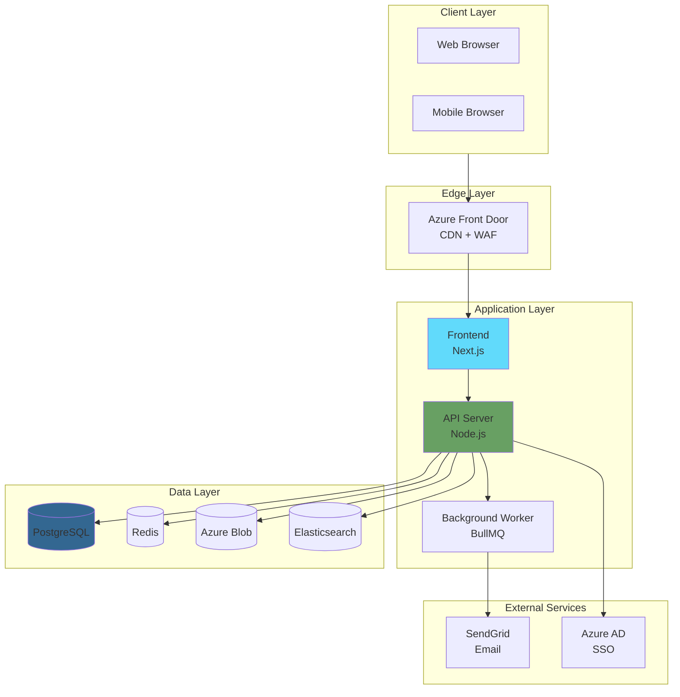
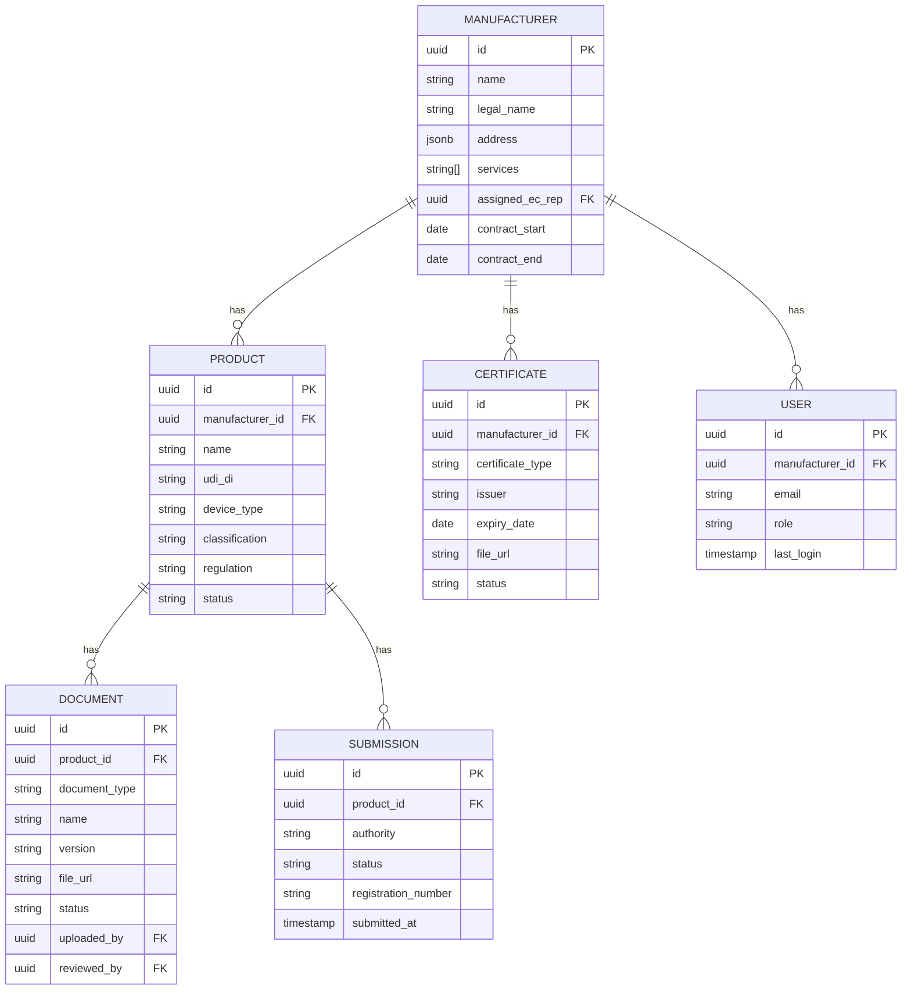
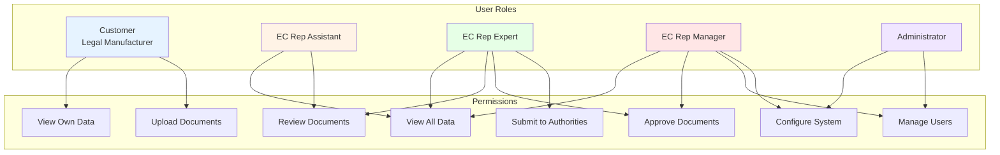
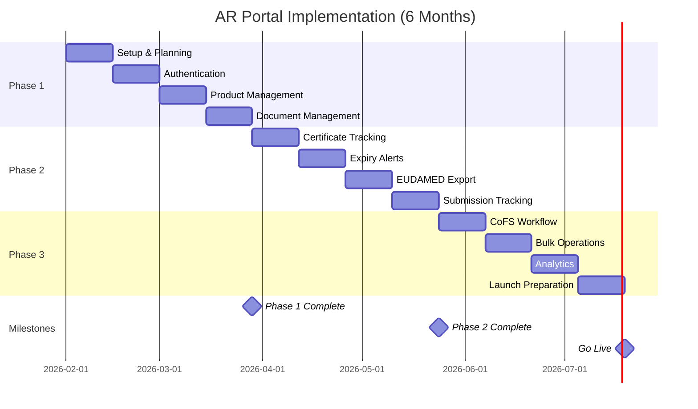
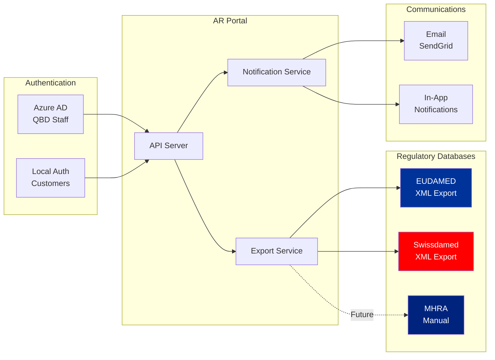

# Architecture Diagrams

## 1. Solution Overview

## 2. Customer Journey Flow

## 3. Document Workflow

## 4. Product Registration Flow

## 5. Certificate Expiry Alert Flow

## 6. System Architecture

## 7. Data Model

## 8. User Roles & Permissions

## 9. Implementation Timeline

## 10. Integration Architecture

## Notes for Presentations

### Exporting Diagrams

1. Copy Mermaid code to [Mermaid Live Editor](https://mermaid.live/)
2. Export as PNG or SVG
3. Import into PowerPoint/Google Slides

### Color Scheme

| Color | Usage |
|-------|-------|
| Green (#90EE90) | New/Success |
| Blue (#87CEEB) | Existing |
| Red (#FFB6C1) | Urgent/Warning |
| Yellow (#FFFACD) | In Progress |
| Gray | External systems |
